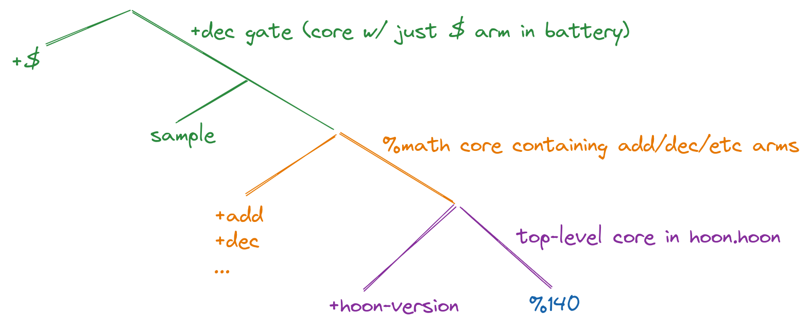

# Jets in the Urbit Runtime

Who you are: someone who a bit of Hoon and (ideally but not necessarily) Nock. You don't know much about the runtime or jet system.

What you'll know after reading: 
- why Urbit jets work the way they do
- what you need to do to write them
- how you'd implement a Nock interpreter that uses them
- how they're going to get easier to manage in future runtimes

And you're going to learn this all pretty quickly, because it's not that complicated!

*Note regarding Nock*
If you *don't* already know Nock, it may be useful to gain a background:
* [Nock Explanation](https://urbit.org/docs/nock/explanation/)
* [Nock for Everyday Programmers](https://blog.timlucmiptev.space/part1.html)

## Motivation

### How You'd Think Jets Work
When people hear about "jets" that can be called in place of Nock funcitons, or that Nock allows "hints" to be compiled into code, they assume that a jet would work roughly as follows:
1. The programmer puts a "hint" on a function, (e.g. `dec`), and that hint compiles around a chunk of code.
2. When the runtime encounters code marked with `dec`, it checks whether it has a jet called `dec`, and calls it with the current subject as the argument if such a jet exists.
3. The jet runs and returns its result.

Of course, this requires trust/verification/testing that the `dec` jet and the Hoon/Nock `dec` work the same way, but that's not too different from software distribution concerns in general.

### Why Jets Don't Work That Way
**disclaimer** The code and description of the runtime in this section are imaginary.
However, the appraoch above doesn't work in practice, because software installed on your Urbit can emit hints that label *any* piece of code as `dec`.  

#### The Problem
Let's assume jets work that way, and imagine that I distribute a piece of software with a gate called `const`, which simply takes its argument and returns it. However, I hint it with the `%dec` hint: 
```
++  const
  ASSUME `dec` HINTING CODE IS HERE
  |=  x=*
  x 
```
Now, when the runtime encounters the Nock compiled from `const` at a call site, it would go ahead and run the `dec` jet if it exists.  Why is that a problem?  Well, to take one case, if the user moved his Urbit to a different runtime that *didn't* have the `dec` jet, and replayed the event log, the resulting ship state would be different.

#### First Attempt at a Fix
A naive solution to this problem would be to register the jet's formula with the runtime (when the runtime is compiled) and then check whether the battery in the hinted core matched the registered formula.

Unfortunately, there's a big problem with that. Any Nock formula can include an instruction to pull code out of any place in the current subject, and execute that code (generally this would be a Nock 9, but it can be done in several ways). So if you have a formula that says
- grab the core at "memory slot" 31
- run arm 4 of that core
we have no way of knowing, just by looking at the formula, what core/code is currently in slot 31.

So it's not enough just to compare the hinted formula to the registered formula; we also must make sure that both have the same subject.

#### Another Problem with the Simple Fix
It gets a bit worse. For simple cores, we could register the battery+payload Nock (or a hash of it) with the runtime, and let the runtime verify any code it's about to jet matches the battery+payload for that jet label.

However, for gates (which are one-armed cores where the payload is treated as `[sample context]`), this doesn't work. The gate caller will change the sample (function argument) when calling, so just registering the battery+payload with the runtime and comparing it doesn't work.  This isn't just an issue with gates: even simple cores can use `=+` to make replaceable samples, to take one example.

#### Note on the Above Problems
The reader may note that these problems could be resolved by requiring users to check jet hints in code they install for conflicts with `hoon.hoon` jet names. As a result, there is some disagreement among Urbit developers as to whether this is a problem. For now, just know that the current runtime *does* consider it to be a problem and takes steps to avoid it, and future solutions seem likely to as well.

#### Problem Summary
To summarize, we cannot use the naive approach ("runtime checks whether this hinted formula is registered") for two reasons:
1. The formula can call formulas located in other parts of the subject
2. The subject itself can be different at different call sites, because of sample replacement (more generally, payload mutation).

In the next section, we will look at the solution Vere (the runtime) currently uses for this.

------------------------------------

## Current Implementation
Vere (the runtime) solves the above problems with a 3-part approach:
- jetted core registration 
- Hoon compilation of jet hints
- run-time matching system to verify that hinted cores match registered ones

### Jetted Core Registration 
At the time the runtime is compiled, we declare all jetted cores that the runtime can use. This is done in `pkg/urbit/jets/tree.c`.
All jetted core declarations must include:
- their label (e.g. `%dec`)
- the hash of their formula
- their location in the tree of cores

#### Tree of Cores
What does "location in the tree of cores mean?"

Declaring a core (using `|%`) returns a data structure that looks like `[battery payload]`, where `battery` is a tree of formulas (the "arms" of the core), and `payload` is the current subject. 

The gate rune `|=` also makes a `[battery payload]` structure, with the additional restriction that `battery` is just one formula (with the face `$`) and that `payload` is of form `[sample context]`, where `sample` is a value that will be replaced at each call site, and `context` is the current subject where the gate is declared.



The above diagram shows what data is held by the `dec` gate in `hoon.hoon`. It is a gate created by the `++  dec` arm in the `%math` core, so its battery is the `dec` Nock formula, and its payload is `[sample math-core]`.  It's "parent" can be thought of as the `%math` core. When the `%math` core itself is declared, its subject is the core with arm `hoon-version`, and so that becomes its context.  

Note that the `dec` gate's context is `[sample parent-core]`, while the `%math` core's context is simply `parent-core]`.  `|=` creates a core with a `sample` in the context, but the important thing is that both cores do *have* a parent core--we just need to address it differently for each case.

#### tree.c Registration
In `tree`.c`, any jetted core must declare which core is its parent, and where in the subject to locate it.  At a broad conceptual level, this means that we can recur backwards through any registered core to see what its parent is expected to be.

### Hoon Compilation of Jet Hints
`tree.c` registration tells Vere which parent cores a given jetted core should have. The next thing we need is a way for Hoon jet hints to *also* commit to a parent core. This is done (usually) using the `~%` and `%/` runes.

Hoon hinting is applied to cores (more on why in a bit), and uses the `~%` rune (or `~/` which is sugar for it). `~%` takes as args:
- a name (e.g. `%dec`)
- a wing that locates this core's "parent"
- list of "hooks" (can ignore for this discussion; usually an empty lis)
`~/` is just `~%` with `+>` (payload of a gate) for the parent wing, and `~` for the hooks list.

**TODO** finish the above

### Run-Time Jet Matching System
Now Vere has enough information to avoid the problems we mentioned in the Motivation section. Whenever it encounters a core that is hinted with a jet, it runs the following algorithm (simplified slightly for explanation):
1. retrieve the jet registered with the hinted label
2. **TODO** finish 

-------------------------------
## Jet Writing Process

