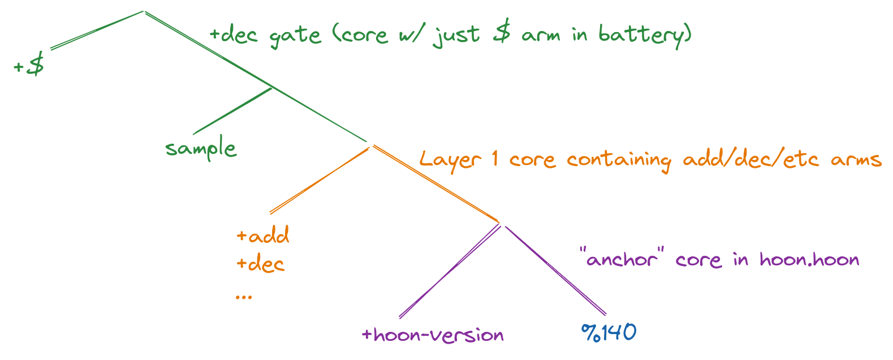

# Jets in the Urbit Runtime (July 2021)
The below document will at some point become outdated, at which point it will be updated as a historical piece to understand how the new jet system was arrived at.

Who you are: someone who knows a bit of Hoon and (ideally but not necessarily) Nock. You don't know much about the runtime or jet system.

What you'll know after reading: 
- why Urbit jets work the way they do
- how Urbit jets currently work
- problems with the current system

And you're going to learn this all pretty quickly, because it's not that complicated!

*Note regarding Nock*
If you *don't* already know Nock, it may be useful to gain a background:
* [Nock Explanation](https://urbit.org/docs/nock/explanation/)
* [Nock for Everyday Programmers](https://blog.timlucmiptev.space/part1.html)

## Motivation

### How You'd Think Jets Work
When people hear about "jets" that can be called in place of Nock functions, or that Nock allows "hints" to be compiled into code, they assume that a jet would work roughly as follows:
1. The Hoon programmer puts a "hint" on a function, (e.g. `dec`), and that Hoon compiles down to a Nock 11 hint wrapping the compiled function.
2. When the runtime encounters code marked with `dec`, it checks whether it has a jet called `dec`, and calls it with the current subject as the argument if such a jet exists.
3. The jet runs and returns its result.

In this model, the primary risks are
- jet code that isn't properly tested
- malicious jets that don't run Nock properly, distributed by the runtime

### Why Jets Don't Work That Way
**disclaimer** The code and description of the runtime in this section are imaginary.
However, the appraoch above doesn't work in practice, because software installed on your Urbit can emit hints that label *any* piece of code as `dec`.  

#### The Problem
Let's assume jets work that way, and imagine that I distribute a piece of software with a gate called `const`, which simply takes its argument and returns it. However, I hint it with the `%dec` hint: 
```
++  const
  ASSUME `dec` HINTING CODE IS HERE
  |=  x=*
  x 
```
Now, when the runtime encounters the Nock compiled from `const` at a call site, it would go ahead and run the `dec` jet if it exists.  Why is that a problem?  Well, to take one case, if the user moved his Urbit to a different runtime that *didn't* have the `dec` jet, and replayed the event log, the resulting ship state would be different.

#### First Attempt at a Fix
A naive solution to this problem would be to register the jet's formula with the runtime (when the runtime is compiled) and then check whether the battery in the hinted core matched the registered formula.

Unfortunately, there's a big problem with that. Any Nock formula can include an instruction to pull code out of any place in the current subject, and execute that code (generally this would be a Nock 9, but it can be done in several ways). So if you have a formula that says...
- grab the core at "tree slot" 31
- run arm 4 of that core

...we have no way of knowing, just by looking at the formula, what core/code is currently in slot 31.

So it's not enough just to compare the hinted formula to the registered formula; we also must make sure that both have the same subject.

#### Another Problem with the Simple Fix
It gets a bit worse. For simple cores, we could register the battery+payload Nock (or a hash of it) with the runtime, and let the runtime verify any code it's about to jet matches the battery+payload for that jet label.

However, for gates (which are one-armed cores where the payload is treated as `[sample context]`), this doesn't work. The gate caller will change the sample (function argument) when calling, so just registering the battery+payload with the runtime and comparing it doesn't work.  This isn't just an issue with gates: even simple cores can use `=+` to make replaceable samples, to take one example.

#### This Problem Is Hard
You might think that you could just analyze any code you're installing to see whether it has jet hints that conflict with existing ones, but that's not sufficient. It's possible to ship a program that dynamically constructs jet hints, and users wouldn't be able to statically analyze to determine this was happening prior to install.

#### Problem Summary
To summarize, the runtime cannot naively check *only* whether a hinted formula matches a registered formula for that hint. It must also make sure that the current subject matches the registered subject, because:

1. subjects can vary in the code and data they hold, even when a formula is the same
2. the same jet run on a different subject can do completely different things, in ways that could be dangerous
3. programmers can create jet hints in ways that make it hard/impossible to check for malicious hinting at compile/install time

In the next section, we will look more mechanically at the solution Vere (the runtime) currently uses for this.

------------------------------------

## Current Implementation
Vere (the runtime) solves the above problems with a 3-part approach:
- jetted core registration 
- Hoon compilation of jet hints
- run-time matching system to verify that hinted cores match registered ones

### Jetted Core Registration 
At the time the runtime is compiled, we declare all jetted cores that the runtime can use. This is done in `pkg/urbit/jets/tree.c`.
All jetted core declarations must include:
- their label (e.g. `%dec`)
- the hash of their formula
- their location in the tree of cores

#### Tree of Cores
What does "location in the tree of cores mean?"

Declaring a core (using `|%`) returns a data structure that looks like `[battery payload]`, where `battery` is a tree of formulas (the "arms" of the core), and `payload` is the current subject. 

The gate rune `|=` also makes a `[battery payload]` structure, with the additional restriction that `battery` is just one formula (with the face `$`) and that `payload` is of form `[sample context]`, where `sample` is a value that each call site replaces with its own argument, and `context` is the current subject where the gate is declared.



The above diagram shows what data is held by the `dec` gate in `hoon.hoon`. It is a gate created by the `++  dec` arm in the layer-1 core, so its battery is the `dec` Nock formula, and its payload is `[sample math-core]`.  It's "parent" can be thought of as the layer-1 core. When the layer-1 core itself is declared, its subject is the core with arm `hoon-version`, and so that becomes its payload.  

Note that the `dec` gate's payload is `[sample parent-core]`, while the layer-1 core's payload is simply `parent-core`.  `|=` creates a core with a `sample` in the context, but the important thing is that both cores do *have* a parent core--we just need to address it differently for each case.

How does this help us? It means that *all* cores include their parent as part of their data structure. As long as we know which part of that data structure holds the parent, we can check at runtime whether it's the parent we were expecting.

#### tree.c Registration
When we register a core in `tree.c`, the core must declare which core is its parent, and where in the subject to locate that parent.  At a broad conceptual level, since each registered core is labeled with its parent's location within its payload, we can recursively follow those labels down the stack of cores all the way down to the root core at the bottom right.

### Hoon Compilation of Jet Hints
`tree.c` registration tells Vere which parent cores a given jetted core should have. Now we need a way for Hoon jet hints to also commit the hinted core to a specific parent core. This is done (usually) using the `~%` and `~/` runes.

Hoon jet hinting is applied directly before core declarations, and uses the `~%` rune (or `~/` which is sugar for it). `~%` takes as args:
- a name (e.g. `%dec`)
- a Hoon expression (usually a wing like `+>` or `..add`) that, when run against the hinted code, produces the parent core"
- list of "hooks" (can ignore for this discussion; usually an empty list)

`~/` is just `~%` with `+>` (`context` of a gate) for the parent wing, and `~` for the hooks list.

The "wing that locates the core's parent" can be:
- a lark expression (`+` locates the parent for a normal `|%` core) 
- a Hoon expression like `..add` ("the core containing the arm `add`")

**note**: keep in mind that the runtime does not *have* to have jets corresponding to jet hints. It can simply run the Nock instead. Hints are often used without matching jets in order to do profiling: if you want a core's arms to show up in a CPU performance flame graph, you put a jet hint on the core.

### Pause and Summary
Before moving to the run-time jet matching system, let's look at what we've bought with jet registration in the binary and Hoon compilation of jet hints:
- the runtime has to commit to a certain set of jets
- those jets have to commit to having specific parents 
- jetted cores in Hoon have to commit to what their parents are

All of this means that any time the runtime comes across a jet hint in Nock code, it has tthe information necessary to see whether the jetted core is indeed registered in the runtime.

### Run-Time Jet Matching System
Now Vere has enough information to avoid the problems we mentioned in the Motivation section. Whenever it encounters a core that is hinted with a jet, it runs the following algorithm (simplified slightly for explanation):
1. retrieve the jet registered with the hinted label from the runtime
2. retrieve the parent core of the jet
3. if the core is an atomic value (`%140` currently), then **SUCCESS**
4. otherwise, check that the core's formula has the same hash as the registered formula
5. run this same algorithm on the parent of the jetted core

Intuitively, we check that the formula of the jetted core matches the formula of the registered core with that label, and if so, recur to check the core's parent against the registered parent.

`hoon.hoon` currently includes an atom (`%140`, for the Kelvin version) at the top of the file, which is the subject when the 1st ("anchor") core is created. Both `tree.c` and the compiled Nock recur back to this.

-------------------------------
## Some Examples
Here we'll look at examples of how registration and hinting look in practice.  We'll use [this version of hoon.hoon](https://github.com/urbit/urbit/blob/b0c9fd1940fe1c119438947ac0a45bafec135860/pkg/arvo/sys/hoon.hoon) in order to be able to refer to line numbers.

### Hoon: Pinned Variable(s): the `by` Door
[The by door](https://github.com/urbit/urbit/blob/b0c9fd1940fe1c119438947ac0a45bafec135860/pkg/arvo/sys/hoon.hoon#L1453) uses `~/` to declare its hint. This is a shortcut for `~%` with the parent core declared as `+>`. Note that `by` is a wet core, and not a gate...however, before declaring the `|@`, it pins the variable `a` as the head of its subject (line 1455). So when the `|@` declaration happens, the subject is `[a current-subject]`, where `current-subject` is the parent core we want to refer to.

### Hoon: Locate Parent with `+`
[The "layer 2" core](https://github.com/urbit/urbit/blob/b0c9fd1940fe1c119438947ac0a45bafec135860/pkg/arvo/sys/hoon.hoon#L437) is hinted with `~%`, and its parent is located with `+` (tail). It's declared in line 438 with a simple `|%` and no variables pinned, so the parent is just the tail of `[formula payload]`.

### Hoon: Locate Parent with a `..` expression
[The `sha` core](https://github.com/urbit/urbit/blob/b0c9fd1940fe1c119438947ac0a45bafec135860/pkg/arvo/sys/hoon.hoon#L437) is hinted with `~%` and the parent as `..sha`. This means "the subject of the core containing the arm `sha`, i.e. `sha`'s parent core.

Why do we use `..sha` here and not a simple lark expression? In line 3617, `=>` creates a core that is captured by `sha` as its `payload`, and the actual parent of `sha` is inside *that* helper core (if this confuses you, draw out the tree of cores). We could still locate `sha`'s parent using the lark expression `+>`. However, it's easier to quickly reason about the code by skipping that chain of reasoning and just say "my parent is the core containing `sha`."

### tree.c
`tree.c` registers cores and their children. Let's follow the chain down from the top-level core of `_140_hex_d` (zuse) to its child [en:base16:mimes](https://github.com/urbit/urbit/blob/master/pkg/arvo/sys/zuse.hoon#L3924):
* [_140_hex_d](https://github.com/urbit/urbit/blob/b0c9fd1940fe1c119438947ac0a45bafec135860/pkg/urbit/jets/tree.c#L441)
* [_140_hex_mimes_d](https://github.com/urbit/urbit/blob/b0c9fd1940fe1c119438947ac0a45bafec135860/pkg/urbit/jets/tree.c#L40)
* [_140_hex_mimes_base16_d](https://github.com/urbit/urbit/blob/b0c9fd1940fe1c119438947ac0a45bafec135860/pkg/urbit/jets/tree.c#L30)
* [_140_hex_mimes_base16_en_d](https://github.com/urbit/urbit/blob/b0c9fd1940fe1c119438947ac0a45bafec135860/pkg/urbit/jets/tree.c#L18)

Note that each parent lists its children, along with the location of that child's parent core. So `_140_hex_mimex_d` in line 40 has child `base16`, which is a normal core, so its parent is found in slot `3`. In contrast, `_140_hex_mimes_base16_d` has children `en` and `de`, which are both gates, so their parent core is found in slot `7`.

### Detailed Note on Matching with `tree.c`
`tree.c` parents store children, but when the interpreter does matching using the hint and the registration, it is starting at the child, and needs to see whether its parent is correct. So the matching process looks like:
1. look up the hinted label
2. check whether it is a top-level parent
3. if not, get the label of its parent using the parent wing in the hint
4. look up that parent label and repeat the algorithm

-------------------------------
## Weaknesses of the Current System
The current system is slower and harder to implement than it needs to be, and a lot of work is being done to fix its issues. A future article will explore the upcoming changes more fully. For now, the primary weaknesses are:

- have to compile jets into the binary
- matching is slower than it needs to be
- configuration is too complex: `tree.c` contains a programmatic tree in a flat file, rather than being declarative
- runtime implementation is more complex than it needs to be, making it hard to write new interpreters
