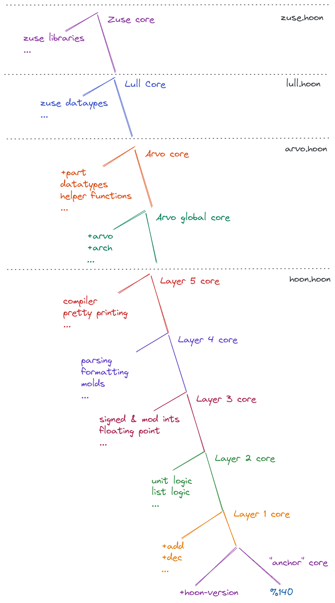

# More Jets: Cores, Implementation and Hints
In the [current jets explainer](jets_current.md), we looked at how jet matching is done. Now, we'll move on to an explanation of Urbit's core stack, detailed examples of a jet and its registration, and the mechanics of how hints are implemented.

## Intro

### Addressing and Lark Expressions
We'll be doing a lot of address lookups in subjects in this explainer, so it would be good to familiarize yourself with [noun addressing and lark expressions in Hoon](https://urbit.org/docs/hoon/hoon-school/the-subject-and-its-legs).

### New Tools
We want to get deeper into how the compiler and runtime handle Nock, so `!=` will be useful throughout this explainer. It lets you enter Hoon at the dojo and see what Nock that Hoon compiles to.  We can do this because every dojo command is run against the current dojo subject, so dojo commands are just Nock formulas.

Since `!=` gets a Nock formula, we can run that formula against the dojo subject by using `.*`:
```
> =x 56
> !=(x)
[0 2]
::  x is located at address 2 in my Dojo subject; yours might be different

> .*(. !=(x))
56

> !=(add)
[9 36 0 2.047]
::  "get the core at slot 2047, and then pull the arm at slot 36 in it"
::  remember, add is an arm that *generates* a gate

::  running that Nock against the subject produces the same gate as
::    pulling the add arm directly 
> =(add .*(. !=(add)))
%.y
```

### Reminders
It's easy to get confused between arms and cores, particularly because arms can produce cores/gates. Remember: arms are just Nock formulas, while cores have formulas on the left side of their tree, and data (payload) on the right side.

## The Core Stack & Parent Registration/Location
All jet lookups depend on recurring back to the "bottom" of the "core stack". This is the subject that is built when an Urbit is booted up. Here's what is produced:



Arvo is bootstrapped with a pre-compiled `hoon.hoon`, and then `lull` and `zuse` are compiled with Arvo as the subject. This creates the above stack of cores, which we can inspect by looking at the subjects of arms in them:
```
::  Layer 1
> ..add
<46.hgz 1.pnw %140>

::  Layer 4
> ..po
<232.wfe 51.qbt 123.zao 46.hgz 1.pnw %140>

::  Arvo global core
> ..arvo
<52.slg 77.wir 232.wfe 51.qbt 123.zao 46.hgz 1.pnw %140>

::  Arvo core
> ..part
<14.wru 52.slg 77.wir 232.wfe 51.qbt 123.zao 46.hgz 1.pnw %140>

> ..lull
<33.kwz 14.wru 52.slg 77.wir 232.wfe 51.qbt 123.zao 46.hgz 1.pnw %140>

> ..zuse
<16.wbm 33.kwz 14.wru 52.slg 77.wir 232.wfe 51.qbt 123.zao 46.hgz 1.pnw %140>
```

**Important**
There is no magic here. Each core is simply constructed, with its parent located in its tail.

### Basic Examples
The payload of the core containing `add` is the anchor core in line 10 of `hoon.hoon`. The 2nd piece of code here produces the core as Nock--note that its final element is `140`, the base parent atom that stops jet matching recursion.
```
> +3:..add
<1.pnw %140>
> .*(. !=(+3:..add))
[[0 3] 140]
```

We get the same thing if we take the tail of the tail of the core with `biff` (layer 2 core). It has the same parent as `add`, just one level further up. Its immediate "parent" is the core with `add`:
```
> +3:..biff
<46.hgz 1.pnw %140>
> ..add
<46.hgz 1.pnw %140>

> +7:biff
<1.pnw %140>
> .*(. !=(+7:..biff))
[[0 3] 140]
```

### More Detailed Example, with `tree.c`
In [line 455 of tree.c](https://github.com/urbit/urbit/blob/b0c9fd1940fe1c119438947ac0a45bafec135860/pkg/urbit/jets/tree.c#L455), we see that the `_140_hex_d` (Arvo) core declares a child called `mimes`. It says that `mimes` parent lives in axis 31. Does that line up with the code?

`mimes` [is declared in zuse.hoon](https://github.com/urbit/urbit/blob/b0c9fd1940fe1c119438947ac0a45bafec135860/pkg/arvo/sys/zuse.hoon#L3899). It says that its parent is `..part`, i.e. the core containing `part` (declared in `arvo.hoon`).

We can verify that the core containing `part` is at axis 31 of `mimes` like so:
```
::  note that from "14.slg", they're the same
> ..part
<14.wru 52.slg 77.wir 232.wfe 51.qbt 123.zao 46.hgz 1.pnw %140>
> ..mimes:html
<13?vdb 16.wbm 33.kwz 14.wru 52.slg 77.wir 232.wfe 51.qbt 123.zao 46.hgz 1.pnw %140>

> =(..part +31:mimes:html)
%.y
```

## Jet Walkthrough
Now we will walk through the Hoon, Nock, and runtime registrations of the `add` jet in full. Before starting, run the below code, which prints the formula that produces the `add` gate. 

Note that this uses Nock 7, *not* Nock 9. It's similar to Nock `[9 36 0 2.047]`--we just don't pull the arm against the subject yet.
```
.*(. [7 [0 +>+:!=(add)] 0 36])
```

The formula printed is a Nock 7 that composes two operations. The first (starting with `[8...`) is just  the formula that produces the add gate. The second operation, starting with `11`, is our jet hint.

### The Compiled Hint
The jet hint:
```
 11
  [1.953.718.630 1 6.579.297 [0 7] 0]
  0
  1
```
The hint finishes with `[0 1]`, so it just returns the current subject after hinting. We care about `[1.953.718.630 1 6.579.297 [0 7] 0]`. This is the form of Nock 11 where the hint is a cell: 
* head: a static value
* tail: a Nock formula that the runtime can compute

The two long numbers represent strings. We can apply `@t` aura in the dojo to see the values they represent:
```
> `@t`1.953.718.630
'fast'
> `@t`6.579.297
'add'
```

So the head is `'fast'`, which the runtime will understand as the tail being a Fast Hint (the current hinting system). 

The tail is a `1` formula that produces `'add'` followed by `[0 7]` (the parent axis of the `add` gate) and `0` (the empty list `~`).

### Registration
Let's follow the `add` jet's registration:
* [layer 1 core declared as only child of the k140 "anchor" core. Layer 1's parent (the anchor core) is declared at axis 3.](https://github.com/urbit/urbit/blob/b0c9fd1940fe1c119438947ac0a45bafec135860/pkg/urbit/jets/tree.c#L2072)
* [add child declared in the layer 1 core. Note that its parent is registered as 7, the axis our hint produced](https://github.com/urbit/urbit/blob/b0c9fd1940fe1c119438947ac0a45bafec135860/pkg/urbit/jets/tree.c#L2050)
* [actual add jet arm](https://github.com/urbit/urbit/blob/b0c9fd1940fe1c119438947ac0a45bafec135860/pkg/urbit/jets/tree.c#L1975)
