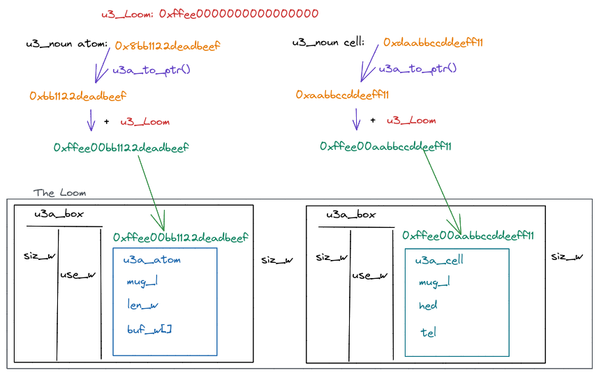

# Nouns & Vere Allocator

## Description

**TODO** explain exactly what the Loom pointer is pointing to, in terms of boxes
- this involves showing how `u3a_botox` is a simple:
  * go to real pointer
  * step back the size of a `u3a_box`
  * return that

## Atoms and Endianness
Vere assumes that the system it is running on is little-endian, meaning that numbers are stored least-significant-byte-first. For example, the number `0xffaa` is stored internally as the bytes `{0xaa, 0xff, 0x00, 0x00}` (in a system with 32-bit words).

Vere represents long atoms as [arrays of words](https://github.com/urbit/urbit/blob/3fc5db758b5b27e574da4d1254768d480998ce63/pkg/urbit/include/noun/allocate.h#L53). The `c3_w` (word) buffer `buf_w` stores the words of the atom least-significant-word-first. So the number `0xdeadbeefaabbccdd` is stored internally as a `u3a_atom` with `buf_w = {0xaabbccdd, 0xdeadbeef}`. And if the system is little-endian, the word `0xaabbccdd` is stored internally as bytes `{0xdd, 0xcc, 0xbb, 0xaa}`.
 
So the below data structures from the example code produce the same atom, when fed into `u3i_bytes` and `u3i_words`, respectively:
(the example code uses `print_atom` on each to show that they're the same)
```
c3_y buf2[8] = {0xdd, 0xee, 0xbb, 0x00, 0x44, 0x33, 0x22, 0x00};
c3_w ws[2] = {0xbbeedd, 0x223344};
```

## Nouns in Vere and the Allocator
The [definition of a u3 noun](https://github.com/urbit/urbit/blob/3fc5db758b5b27e574da4d1254768d480998ce63/pkg/urbit/include/noun/aliases.h#L35) is just a `c3_w`, i.e. a 32-bit integer.

In allocate.h, we can see [the rules for determining what type of noun](https://github.com/urbit/urbit/blob/3fc5db758b5b27e574da4d1254768d480998ce63/pkg/urbit/include/noun/allocate.h#L199) our 32-bit integer is:
* most significant bit is 0: it's an atom (<= 2^31) whose value is just the value of the integer (a `cat`)
* most significant bit is 1: it's a long atom or cell (a `dog`)
These tests just use simple bit shifting: right-shifting the noun 31 bits just leaves the most significant bit by itself.

Long atoms and cells (`dog`s) are represented as pointers to the Loom. If the high 2 bits are `10`, it's a long atom. If `11`, it's a cell. The 3rd high bit is always 0, so dogs always start as `100` or `110`, meaning Loom pointers always start in hex with one of: `0x8`, `0x9`, `0xc` or `0xd`.

In `playcore.c`, we create a cell using `u3nc`; the cell's head is a `cat`, tail is a `pug` (long atom). We print it out, and see that it starts with `0xd` (`1101`), as we expect for a `dog` that's a cell. The hex value *after* `0xd` is the Loom offset pointer.

### from Loom Offsets to Real Pointers 
To inspect the cell's head and tail, we need to access the actual data structure referenced by its Loom pointer.
[allocate.h provides the helper macro `u3a_to_ptr`](https://github.com/urbit/urbit/blob/3fc5db758b5b27e574da4d1254768d480998ce63/pkg/urbit/include/noun/allocate.h#L205), which first strips the high 2 bits using `u3a_to_off`, and then uses the `u3a_into` macro to add the resulting offset to the `u3_Loom` value, which is the starting point in memory of the Loom.

The pointer from `u3a_into` is a `(void *)`, so it's up to us to know whether the pointer is to a `u3a_atom` or a `u3a_cell`. Since we already did the `u3a_is_pom` check, we know it's a cell, so we cast to that and then take the `hed` and `tel`.

`hed` and `tel` are themselves are `u3_noun`s, so we can print them out directly. `hed` is a `cat`, and `tel` is a Loom pointer. 

## Noun Lifecycle
Let's make this discussion more concrete by just going ahead and creating some nouns. As we do so, we can inspect them to see what is happening inside the allocator . We will also walk through the code that allocates each noun.

### Simplest: `cat` Atom from a `word`
`u3_noun cat_atom = u3i_word(0x11ff);`
This [just checks](https://github.com/urbit/urbit/blob/3fc5db758b5b27e574da4d1254768d480998ce63/pkg/urbit/noun/imprison.c#L292) whether the argument is <= 2^31, and casts it as a `u3_atom` and returns.

Otherwise, we're dealing with a number < 2^32, but that needs a Loom pointer. `u3i_word` allocates enough words to hold the `u3a_atom` data structure, plus 1 word to hold the atom itself, which we know will fit in 1 word.

It then creates two pointers to the same allocated memory: one is a `c3_w*`, the other a `u3a_atom*`. This is an *extremely* common pattern thoughout Vere. It allows the function to treat the pointer as a `c3_w*` when getting the return from `u3a_walloc`, and as a `u3a_atom` when setting the `mug`, `len_w` and `buf_w` fields.

Finally, we use `u3a_outa` to turn the real pointer in a Loom offset, and `u3a_to_pug` to add the leading `10` that `pug` atoms get.

### Atoms from Longer Data Structures 
Our example above created an atom from just a word, so the code was able to make assumptions about the data length. However, what if we want to initialize an arbitrarily long atom?

To do this, we use `u3i_bytes` or `u3i_words`, which both use the [u3i_slab](https://github.com/urbit/urbit/blob/3fc5db758b5b27e574da4d1254768d480998ce63/pkg/urbit/include/noun/imprison.h#L10) type to allocate a bare block of memory, copy the data into it, and then use [u3i_slab_mint](https://github.com/urbit/urbit/blob/3fc5db758b5b27e574da4d1254768d480998ce63/pkg/urbit/noun/imprison.c#L214) and [_ci_atom_mint](https://github.com/urbit/urbit/blob/3fc5db758b5b27e574da4d1254768d480998ce63/pkg/urbit/noun/imprison.c#L66) to finalize the atom on the Loom.

#### a `cat` atom
```
c3_y buf1[4] = {0xff, 0xff, 0xff, 0x7f};
u3_noun longest_cat = u3i_bytes(4, buf1);
```
`u3i_bytes` and `u3i_words` both assume Little Endian byte ordering, i.e. the first array element (`0xff`) is the *smallest*/*least significant* byte, so the actual number here is 0x7fffffff.

#### a `dog` Atom
Function flow
* u3i_words (382)
* u3i_slab_bare
* _ci_slab_init (28)
* u3i_slab_moot (253) 
**NOTE**: box stuff all happens in `allocate.c`, `_ca_willoc`

**TODO** instructions to install new jets file
**TODO** deconstruct the cell manually instead of using u3x_cell. Use u3a_to_ptr, which makes my noun into a real pointer
**TODO** do `u3a_botox` on the cell's raw pointer to show it on the Loom (see me_gain)
- botox takes the pointer given, then steps back the size of box, which can be done for EVERYTHING on the Loom.

## Initialization
